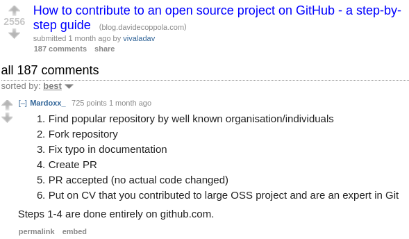

SpellingHero
============

 

The SpellingHero is just someone who wants to get started on open source
contributions. What better way than by fixing spelling mistakes in
documentation? SpellingHero scours github for fixes to make, in a similar but
unrelated fashion to
[Wikipedia bots](https://en.wikipedia.org/wiki/Wikipedia:Bots). Maybe
SpellingHeroine will be the first in a line of Github bots. Who knows?

Usage
-----

I highly encourage the use of [virtual
environments](https://virtualenv.pypa.io/en/stable/). However, user escalating
to `root` always works in a pinch.

Install dependencies with: `pip install -r requirements.txt`

For good results, you probably want to start with a nice text corpus (even
though the spell checker gets better with use).  `big.txt` is included as a
sample corpus, but you should add text files to the `corpus` directory for
better results. I started out with the
[python documentation](https://docs.python.org/3/download.html). In the
future, I'll
provide a pickle file in the repo, but the spell checking engine will go
through major revisions before that.
